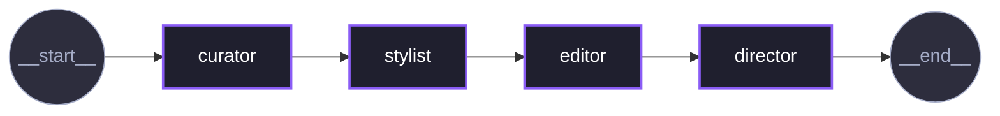
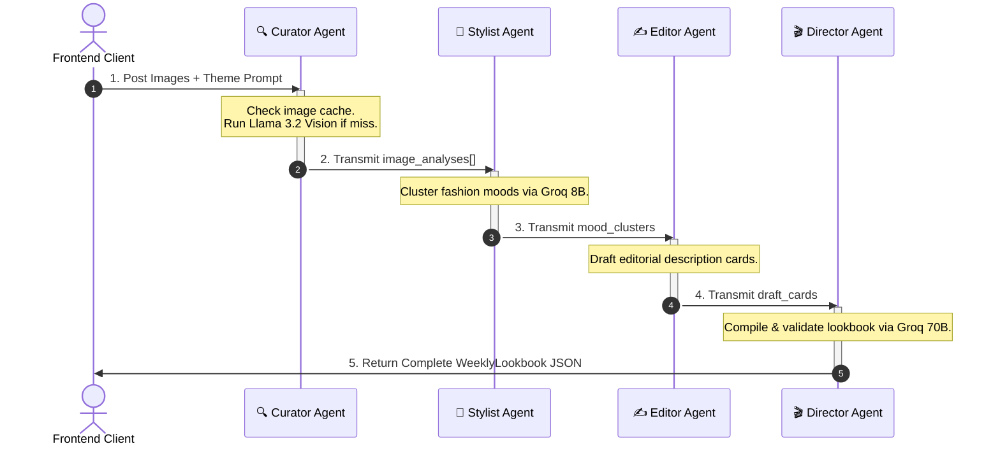

<p align="center">
  <video src="https://github.com/user-attachments/assets/498ef892-7cb2-4b1a-9d49-5ca4c8a7943f" width="90%" controls autoplay loop muted></video>
</p>

<h1 align="center">AINAA</h1>
<h3 align="center">AI-Native Editorial Lookbook Generator</h3>
<p align="center">
  <em>Four agents. One editorial vision. Publication-ready fashion intelligence.</em>
</p>

<p align="center">
  <a href="https://www.python.org/downloads/"></a>
  <a href="https://fastapi.tiangolo.com/"></a>
  <a href="https://langchain-ai.github.io/langgraph/"></a>
  <a href="https://python.langchain.com/"></a>
  <a href="https://build.nvidia.com/"></a>
  <a href="https://groq.com/"></a>
  <a href="https://docs.pydantic.dev/"></a>
  <a href="https://jinja.palletsprojects.com/"></a>
  <a href="https://developer.mozilla.org/en-US/docs/Web/JavaScript"></a>
  <a href="https://smith.langchain.com/"></a>
  <a href="LICENSE"></a>
  <a href="#"></a>
  <a href="#"></a>
</p>

---

> **AINAA** is a production-grade multi-agent AI system that transforms raw fashion images into publication-ready editorial lookbooks. Powered by a four-stage LangGraph pipeline — Curator → Stylist → Editor → Director — it processes garment imagery using NVIDIA's vision LLM and synthesizes culturally-aware editorial copy using Groq-accelerated language models. The result: a structured `WeeklyLookbook` with editorial mood clusters, designer attributions, and vibe prose that reads like *System Magazine* or *032c*.

---

## Table of Contents

- [Overview](#-overview)
- [Key Features](#-key-features)
- [System Architecture](#-system-architecture)
- [Agentic Workflow](#-agentic-workflow)
- [LangGraph State Management](#-langgraph-state-management)
- [Repository Structure](#-repository-structure)
- [Executive Sequence Timeline](#-executive-sequence-timeline)
- [Caching Layer](#-caching-layer)
- [API Documentation](#-api-documentation)
- [Frontend](#-frontend)
- [Installation](#-installation)
- [Running the Project](#-running-the-project)
- [Example Output](#-example-output)
- [Observability](#-observability)
- [Research Inspiration](#-research-inspiration)
- [Citation](#-citation)
- [License](#-license)

---

## 📐 Overview

### The Problem

Fashion intelligence has historically lived inside the minds of editors, stylists, and creative directors. The process of transforming raw garment photography into editorial-grade lookbooks is manual, expensive, time-consuming, and bottlenecked by subjective human availability.

Traditional content pipelines cannot scale editorial judgment. A fashion brand producing hundreds of SKUs per season faces an impossible throughput problem: too many garments, too few editorial hours.

### The Motivation

AINAA was designed around a single insight: **editorial intelligence is compositional**. It can be decomposed into discrete, sequenced cognitive tasks — analysis, clustering, copywriting, and direction — each of which a specialized AI agent can execute with high fidelity.

Multi-agent architectures are the natural fit for this decomposition. Rather than asking a single monolithic model to do everything, AINAA assigns each cognitive role to a dedicated agent with a specific system prompt, model, and output schema. This produces sharper, more consistent, more editorially coherent outputs.

### Why Editorial Fashion Intelligence Matters

- Editorial lookbooks drive consumer purchasing intent and brand narrative
- AI-native tools can democratize access to luxury-grade editorial production
- Structured, schema-validated outputs make fashion AI composable with downstream systems (e-commerce, recommendation engines, PDF export, CMS publishing)
- Multi-agent pipelines enforce separation of concerns: vision understanding, mood reasoning, and creative direction never contaminate each other

---

## ✨ Key Features

| Feature | Description |
|---|---|
| **Multi-Agent Editorial Pipeline** | Four specialized agents (Curator, Stylist, Editor, Director) with deliberate epistemic isolation |
| **Vision-Based Garment Understanding** | NVIDIA NIM `meta/llama-3.2-90b-vision-instruct` analyzes garment type, color palette, silhouette, fabric, era, occasion, and standout detail |
| **Mood Clustering** | Stylist agent groups images into evocative editorial territories (*"Tokyo Fog"*, *"Velvet Static"*, *"Chrome Reverie"*) |
| **Editorial Story Generation** | Editor agent writes cinematic vibe descriptions with culturally-relevant designer attributions |
| **Creative Direction** | Director agent assigns publication-worthy edition titles and quality-gates all copy |
| **LangGraph Orchestration** | Compiled `StateGraph` with typed edges: START → curator → stylist → editor → director → END |
| **Persistent SHA-256 Caching** | Four independent JSON caches (curator, stylist, editor, director) eliminate redundant API calls |
| **FastAPI API Layer** | Async REST API supporting URL-based and local-file image ingestion with base64 handling |
| **Web Interface** | Minimal Jinja2 + CSS + JavaScript frontend for interactive lookbook generation |
| **Token Usage Tracking** | Per-agent input/output/total token telemetry accumulated via LangGraph state reducer |
| **LangSmith Observability** | Full trace logging enabled via `LANGSMITH_TRACING=true` |
| **Multi-Provider LLM Strategy** | NVIDIA NIM for vision; Groq for fast language reasoning — provider diversity for cost and latency optimization |

---

## 🏛 System Architecture

AINAA is structured as a **directed acyclic multi-agent pipeline** orchestrated by LangGraph's `StateGraph`. Each agent is an independent Python class with its own LLM client, cache, prompt, and Pydantic output schema.



The pipeline graph above is auto-generated by LangGraph's Mermaid renderer on every compile (`compiled_graph.get_graph().draw_mermaid_png()`), making it a live artifact of the actual execution graph — not a manually drawn diagram.

### Pipeline Overview

```text

Input Images + Theme Prompt
        │
        ▼
┌───────────────────┐
│   CURATOR AGENT   │  ← NVIDIA NIM (Llama 3.2 90B Vision)
│  Vision Analysis  │  → ImageAnalysis × No. of Images
└───────────────────┘
        │
        ▼
┌───────────────────┐
│   STYLIST AGENT   │  ← Groq (Llama 3.1 8B Instant)
│  Mood Clustering  │  → MoodClusters
└───────────────────┘
        │
        ▼
┌───────────────────┐
│   EDITOR AGENT    │  ← Groq (Llama 3.1 8B Instant)
│  Editorial Copy   │  → EditorialCards
└───────────────────┘
        │
        ▼
┌───────────────────┐
│  DIRECTOR AGENT   │  ← Groq (Llama 3.3 70B Versatile)
│  Final Direction  │  → WeeklyLookbook
└───────────────────┘
        │
        ▼
  WeeklyLookbook JSON
```

### Agent Responsibilities

| Agent | Role | Model | Output Schema |
|---|---|---|---|
| **Curator** | Vision-based garment analysis | `meta/llama-3.2-90b-vision-instruct` (NVIDIA NIM) | `ImageAnalysis` |
| **Stylist** | Mood territory clustering | `llama-3.1-8b-instant` (Groq) | `MoodClusters` |
| **Editor** | Editorial copywriting | `llama-3.1-8b-instant` (Groq) | `EditorialCards` |
| **Director** | Creative direction & finalization | `llama-3.3-70b-versatile` (Groq) | `WeeklyLookbook` |

---

## 🤖 Agentic Workflow

### Curator Agent

**File:** `src/agents/curator_agent.py`

The Curator is the sensory front-end of the pipeline. It receives raw fashion images and returns structured visual analyses.

**Purpose:** Extract objective, fashion-literate observations from garment photography using a vision-capable LLM. Think: a senior Vogue editor's first assessment of a garment rack.

**Model:** `meta/llama-3.2-90b-vision-instruct` via NVIDIA NIM  
**Temperature:** 0.5 | **Max Tokens:** 150  
**Structured Output:** `.with_structured_output(ImageAnalysis)`

**Process:**

1. Receives an image path and index
2. Computes a SHA-256 hash of the image file bytes as the cache key
3. Returns cached result if available (zero-token cached response)
4. Encodes image as base64 JPEG data URL
5. Sends `SystemMessage` (CURATOR_SYSTEM_PROMPT) + `HumanMessage` with embedded image
6. Receives `ImageAnalysis` as structured JSON via constrained decoding
7. Saves to `data/cache/curator_cache.json`

**Prompt Philosophy:** The prompt positions the model as a fashion editor at *Vogue, SSENSE, Net-a-Porter, and Highsnobiety* — biasing outputs toward precision, luxury terminology, and visual acuity. Rules explicitly prohibit hallucinating brand logos and mandate nuanced color naming ("verdigris" not "green").

**Output Schema:**

```python
class ImageAnalysis(BaseModel):
    garment_type: str          # primary garment category
    color_palette: List[str]   # up to 5 nuanced fashion color names
    silhouette: str            # precise silhouette descriptor
    texture_or_fabric: str     # dominant fabric or texture
    style_era: str             # closest style movement or era
    occasion: str              # most natural occasion fit
    standout_detail: str       # single most memorable design detail
    image_index: int | None
    filename: str | None
```

---

### Stylist Agent

**File:** `src/agents/stylist_agent.py`

The Stylist operates without access to the raw images. It sees only the structured `ImageAnalysis` outputs from the Curator — a deliberate epistemic isolation that forces mood reasoning to be grounded in described attributes, not raw pixels.

**Purpose:** Transform multiple garment analyses into emotionally coherent editorial mood clusters. Moods are the organizing logic of a lookbook.

**Model:** `llama-3.1-8b-instant` via Groq  
**Temperature:** 0.6 | **Max Tokens:** 512  
**Structured Output:** `.with_structured_output(MoodClusters)`

**Process:**

1. Receives all `ImageAnalysis` objects and the editorial theme prompt
2. Generates a SHA-256 cache key from `theme_prompt + analyses_json`
3. Returns cached result if available
4. Formats `STYLIST_USER_TEMPLATE` with theme, image count, and serialized analyses
5. Invokes LLM to produce `MoodClusters` — groups of image indices sharing an editorial territory
6. Saves to `data/cache/stylist_cache.json`

**Prompt Philosophy:** The Stylist is instructed to "think in moods, not garments." Mood titles must be evocative and publishable (*"Cimmerian Dusk"*, *"Electric Nomad"*, *"Sakura Static"*). Generic labels like *"Casual"* or *"Streetwear"* are explicitly prohibited. Every image index must appear in exactly one cluster.

**Output Schema:**

```python
class MoodCluster(BaseModel):
    mood_title: str            # evocative editorial mood name
    sub_tags: List[str]        # up to 3 stylistic descriptors
    image_indices: List[int]   # which images belong to this mood
    styling_rationale: str     # brief justification

class MoodClusters(BaseModel):
    clusters: List[MoodCluster]
```

---

### Editor Agent

**File:** `src/agents/editor_agent.py`

The Editor receives mood clusters and curator analyses together, synthesizing them into editorial fashion copy for each lookbook card.

**Purpose:** Write cinematic, culturally-aware editorial prose. Brand attributions. Precise product nomenclature. Present-tense vibe descriptions that open with a sensory or cultural observation.

**Model:** `llama-3.1-8b-instant` via Groq  
**Temperature:** 0.7 | **Max Tokens:** 800  
**Structured Output:** `.with_structured_output(EditorialCards)`

**Process:**

1. Receives `MoodClusters` + `ImageAnalysis` list + theme prompt
2. Constructs card briefs combining mood metadata and visual observations
3. Checks `data/cache/editor_cache.json` for matching hash
4. Invokes LLM to produce `EditorialCards` — one card per mood cluster
5. Saves result to cache

**Prompt Philosophy:** The Editor's system prompt invokes the editorial standards of *System Magazine, Novembre, 032c, Acne Paper, SSENSE Editorial*. Writing principles: mood first, product second. No superlatives, no marketing language, no filler. Designer attributions must be culturally relevant (Rick Owens, The Row, Lemaire, Maison Margiela, Issey Miyake). Product types must use precise fashion terminology (*"oversized graphic tee"* not *"shirt"*).

**Output Schema:**

```python
class EditorialCard(BaseModel):
    card_index: int
    brand_or_designer: str      # culturally relevant designer
    product_type: str           # precise fashion terminology
    vibe_description: str       # 1-2 cinematic sentences

class EditorialCards(BaseModel):
    cards: List[EditorialCard]
```

---

### Director Agent

**File:** `src/agents/director_agent.py`

The Director is the final gatekeeper. It receives the assembled draft lookbook — combining mood metadata with editorial copy — and produces the authoritative `WeeklyLookbook` with a publication-worthy edition title.

**Purpose:** Assign edition titles. Quality-gate all editorial copy. Standardize card formatting. Rewrite weak vibe descriptions. Deliver the final, publication-ready artifact.

**Model:** `llama-3.3-70b-versatile` via Groq  
**Temperature:** 0.8 | **Max Tokens:** 1200  
**Structured Output:** `.with_structured_output(WeeklyLookbook)`

**Process:**

1. Merges clusters and editorial cards into structured draft objects
2. Serializes the draft to JSON for LLM review
3. Checks `data/cache/director_cache.json`
4. Invokes the highest-capability model in the pipeline
5. Returns `WeeklyLookbook` with zero-padded card numbers, corrected totals, and improved copy
6. Saves to cache

**Prompt Philosophy:** The Director holds *final authority over everything that ships*. Edition titles must be typographic and conceptual (*"Meridian"*, *"The Negative Space Issue"*, *"Quiet Systems"*, *"Surface Tension"*). The Director is instructed to preserve strong writing and rewrite weak copy — enforcing quality from a senior creative direction posture.

**Output Schema:**

```python
class FinalLookbookCard(BaseModel):
    card_number: str           # zero-padded: "01", "02", ...
    mood_title: str
    sub_tags: List[str]
    brand_or_designer: str
    product_type: str
    vibe_description: str

class WeeklyLookbook(BaseModel):
    edition_title: str         # publication-worthy title
    total_moods: int
    collection: List[FinalLookbookCard]
```

---

## 🧠 LangGraph State Management

AINAA uses LangGraph's `TypedDict`-based state for type-safe, structured inter-agent communication.

```python
class LookbookState(TypedDict):
    """Typed state object shared across all agent nodes."""
    image_paths:    List[str]
    theme_prompt:   str
    image_analyses: Optional[List[ImageAnalysis]]
    mood_clusters:  Optional[MoodClusters]
    draft_cards:    Optional[EditorialCards]
    lookbook:       Optional[WeeklyLookbook]
    token_usages:   Annotated[List[TokenUsage], operator.add]
```

### Design Decisions

**Unidirectional state flow:** Each node reads upstream fields and writes only its own output fields. No agent mutates another's outputs. This enforces clean separation of concerns and makes the pipeline deterministic and debuggable.

**Epistemic isolation:** The Stylist receives only `image_analyses` (not raw images). The Editor receives both clusters and analyses but not images. The Director receives only assembled draft cards. This is a deliberate design choice: each agent reasons only from what it needs, preventing contamination of creative judgment.

**Token usage accumulation:** `token_usages` uses LangGraph's `Annotated[List[TokenUsage], operator.add]` reducer pattern. Each node returns a list of `TokenUsage` objects which are appended (not replaced) to the accumulated state. This produces a complete per-agent telemetry trace.

```python
class TokenUsage(BaseModel):
    agent_name:     str
    input_tokens:   int
    output_tokens:  int
    total_tokens:   int
```

### State Transitions

| From | Writes To | Data Produced |
|------|-----------|---------------|
| `START` → `curator` | `image_analyses`, `token_usages` | Per-image garment understanding |
| `curator` → `stylist` | `mood_clusters`, `token_usages` | Thematic mood groupings |
| `stylist` → `editor` | `draft_cards`, `token_usages` | Editorial copy per card |
| `editor` → `director` | `lookbook`, `token_usages` | Final compiled lookbook |
| `director` → `END` | — | Terminal state |

### Token Usage Accumulation

Each node returns a `List[TokenUsage]`. LangGraph's `Annotated` `operator.add` automatically merges them into a consolidated list, enabling cross-pipeline telemetry and cost analysis.

---

## 📁 Repository Structure

```text
Agentic-Lookbook-Generator/
│
├── api.py                          # FastAPI application (routes, middleware, image handling)
├── main.py                         # CLI entrypoint for direct pipeline execution
├── pipeline_graph.png              # Auto-generated LangGraph visualization
├── requirements.txt                # Python dependencies
├── pyproject.toml                  # Project metadata and build config
├── .python-version                 # Python version pin
│
├── src/                            # Core application source
│   ├── agents/                     # Agent class implementations
│   │   ├── __init__.py
│   │   ├── curator_agent.py        # Vision analysis (NVIDIA NIM)
│   │   ├── stylist_agent.py        # Mood clustering (Groq Llama 3.1 8B)
│   │   ├── editor_agent.py         # Editorial copywriting (Groq Llama 3.1 8B)
│   │   └── director_agent.py       # Creative direction (Groq Llama 3.3 70B)
│   │
│   ├── pipeline/
│   │   └── pipeline.py             # LangGraph StateGraph assembly & compilation
│   │
│   ├── prompts/
│   │   └── prompts.py              # All system prompts and user templates (357 lines)
│   │
│   ├── schemas/
│   │   └── schema.py               # Pydantic models: ImageAnalysis, MoodClusters,
│   │                               # EditorialCards, WeeklyLookbook, TokenUsage
│   │
│   ├── state/
│   │   └── state.py                # LookbookState TypedDict with operator.add reducer
│   │
│   ├── utils/
│   │   └── utils.py                # encode_image (base64), count_tokens (tiktoken)
│   │
│   ├── logger/                     # Custom colorlog logger
│   └── exception/                  # Custom exception with sys traceback
│
├── data/                           # Runtime data directory
│   ├── cache/                      # Persistent JSON caches
│   │   ├── curator_cache.json      # SHA-256 keyed image analysis cache
│   │   ├── stylist_cache.json      # Theme+analysis hash keyed mood cache
│   │   ├── editor_cache.json       # Editorial cards cache
│   │   └── director_cache.json     # Final lookbook cache
│   ├── uploads/                    # Runtime image uploads (URL downloads + base64)
│   └── *.jpg / *.png               # Local sample fashion images
│
├── templates/
│   └── index.html                  # Jinja2 HTML template (web interface)
│
├── static/
│   ├── style.css                   # Interface styling
│   └── script.js                   # Frontend interaction logic
│
├── notebooks/                      # Experimental Jupyter notebooks
└── logs/                           # Application log files
```

### Module Descriptions

| Module | Purpose |
|--------|---------|
| `src/agents/` | Self-contained agent classes with private caching, LLM binding, and Pydantic structured output |
| `src/pipeline/` | LangGraph orchestration — nodes, edges, graph compilation, and mermaid PNG export |
| `src/prompts/` | Single source of truth for all system and user prompt templates |
| `src/schemas/` | Pydantic v2 models for type-safe serialization across all agent boundaries |
| `src/state/` | Centralized `TypedDict` state definition with `operator.add` for token aggregation |
| `src/utils/` | Reusable helpers (base64 image encoding, tiktoken counting, markdown fence stripping) |
| `src/logger/` | Singleton logger with colored console output and rotating file handlers |
| `src/exception/` | Custom exceptions that auto-parse `sys.exc_info()` and emit structured logs |
| `api.py` | FastAPI entrypoint with CORS, file upload handling, URL downloads, base64 support |
| `main.py` | CLI entrypoint for local testing with hardcoded sample images |

---

## 🔀 Executive Sequence Timeline



---

## 💾 Caching Layer

AINAA implements a **four-tier persistent caching strategy** — one cache per agent — that writes structured JSON to disk between pipeline runs.

### Cache Architecture

| Cache | File | Key Strategy | Cache Scope |
|---|---|---|---|
| **Curator Cache** | `data/cache/curator_cache.json` | SHA-256 of raw image file bytes | Per image file (content-addressed) |
| **Stylist Cache** | `data/cache/stylist_cache.json` | SHA-256 of `theme_prompt + analyses_json` | Per (theme, image set) pair |
| **Editor Cache** | `data/cache/editor_cache.json` | SHA-256 of card briefs + theme | Per editorial context |
| **Director Cache** | `data/cache/director_cache.json` | SHA-256 of `theme_prompt + draft_json` | Per finalization context |

### Engineering Design

**Curator uses content-addressed caching.** The SHA-256 hash is computed from raw image bytes, not filenames. This means the same garment image will always produce a cache hit regardless of what it's named — eliminating redundant vision API calls even when images are renamed or re-uploaded.

**Downstream caches use semantic content hashing.** The Stylist, Editor, and Director caches hash the full semantic content of their inputs (prompts + upstream outputs). Any change in theme, image set, or upstream agent output produces a new cache key and triggers a fresh LLM call.

**Cached token usage is zeroed out.** When a cache hit occurs, the returned `TokenUsage` object reports 0 input, 0 output, and 0 total tokens — accurately reflecting that no API call was made. This keeps token telemetry truthful.

**Cost optimization:** In practice, the Curator is the most expensive agent (vision API calls for each image). Caching image analyses eliminates the dominant cost driver for repeated runs with the same images.

**Latency reduction:** Complete pipeline runs on fully cached inputs return in milliseconds. Cold runs on 4 images typically complete in 15–30 seconds.

**Engineering tradeoff:** The current design does not support cache invalidation by TTL or version. Cache entries persist until manually cleared. For production deployment, a Redis-backed cache with TTL would be appropriate.

---

## 🔌 API Documentation

The FastAPI application (`api.py`) exposes four routes with CORS enabled for local development origins.

### `GET /`

Serves the Jinja2 HTML web interface.

**Response:** `HTMLResponse` — renders `templates/index.html`

---

### `GET /health`

Health check endpoint for uptime monitoring.

**Response:**

```json
{
  "status": "healthy",
  "service": "Agentic Lookbook Generator API"
}
```

---

### `POST /generate`

Primary endpoint. Accepts image URLs or base64 data URLs and runs the full pipeline.

**Request Body:**

```json
{
  "theme_prompt": "Tokyo after midnight — neon-soaked minimalism meets Showa-era nostalgia",
  "image_urls": [
    "https://example.com/garment1.jpg",
    "https://example.com/garment2.jpg",
    "data:image/jpeg;base64,/9j/4AAQ..."
  ]
}
```

**Validation:**

- Minimum 2 images required
- Theme prompt must be at least 5 characters
- Supports both HTTPS URLs and base64 data URLs

**Image Processing:**

- HTTPS URLs: downloaded via `httpx.AsyncClient` with browser-mimicking User-Agent, MD5-hashed for cache key
- Base64 data URLs: decoded, MD5-hashed from bytes, saved directly to `data/uploads/`
- All processing is concurrent via `asyncio.gather()`

**Response:**

```json
{
  "lookbook": {
    "edition_title": "Quiet Systems",
    "total_moods": 2,
    "collection": [
      {
        "card_number": "01",
        "mood_title": "Tokyo Fog",
        "sub_tags": ["Cyberpunk", "Monochrome", "Oversized"],
        "brand_or_designer": "Issey Miyake",
        "product_type": "oversized graphic tee with abstract print",
        "vibe_description": "Neon bleeds through rain-soaked concrete. The graphic dissolves into the city's white noise, worn like an exhale."
      }
    ]
  },
  "token_usage": [
    {"agent_name": "Curator Agent", "input_tokens": 420, "output_tokens": 85, "total_tokens": 505},
    {"agent_name": "Stylist Agent", "input_tokens": 312, "output_tokens": 148, "total_tokens": 460},
    {"agent_name": "Editor Agent", "input_tokens": 580, "output_tokens": 210, "total_tokens": 790},
    {"agent_name": "Director Agent", "input_tokens": 720, "output_tokens": 340, "total_tokens": 1060}
  ],
  "total_tokens": 2815
}
```

---

### `POST /generate-from-data`

Runs the pipeline on images already present in the `data/` directory. Useful for CLI-style invocation without URL uploading.

**Query Parameter:**

```
?theme_prompt=Tokyo+after+midnight
```

**Behavior:** Scans `data/` for `*.jpg`, `*.jpeg`, `*.png`, `*.webp` files and processes them directly.

**Response:** Same structure as `/generate`.

---

## 🖥 Frontend

The web interface is a minimal, self-contained HTML/CSS/JavaScript application rendered via Jinja2 templates.

**`templates/index.html`** — Jinja2 template providing the application shell. Renders a form for theme prompt input and image URL collection. Displays the generated lookbook as formatted editorial cards.

**`static/style.css`** — Interface styling. Designed to be minimal and editorial — reflecting the aesthetic sensibility of the platform itself.

**`static/script.js`** — Frontend interaction logic. Handles form submission, async fetch to `/generate`, JSON response parsing, and dynamic rendering of lookbook cards. Supports adding/removing image URL inputs.

The frontend is mounted as a static files directory at `/static` and served by the FastAPI application via `StaticFiles(directory="static")`.

---

## ⚙️ Installation

### Prerequisites

- Python 3.11+
- NVIDIA NIM API Key ([build.nvidia.com](https://build.nvidia.com))
- Groq API Key ([console.groq.com](https://console.groq.com))
- LangSmith API Key ([smith.langchain.com](https://smith.langchain.com)) *(optional, for observability)*

### Clone & Setup

```bash
# Clone the repository
git clone https://github.com/ArpitKadam/Agentic-Lookbook-Generator.git
cd Agentic-Lookbook-Generator

# Install Python 3.11 and synchronize dependencies instantly
uv sync --python 3.11

# Activate the local virtual environment
source .venv/bin/activate  # On Windows (CMD/PowerShell) use: .venv\Scripts\activate
```

### Environment Variables

Create a `.env` file in the project root:

```env
# Required
NVIDIA_API_KEY=nvapi-xxxxxxxxxxxxxxxxxxxxxxxxxxxxxxxxxxxx
GROQ_API_KEY=gsk_xxxxxxxxxxxxxxxxxxxxxxxxxxxxxxxxxxxx

# Optional — enables LangSmith tracing
LANGSMITH_API_KEY=lsv2_xxxxxxxxxxxxxxxxxxxxxxxxxxxxxxxxxxxx
```

| Variable | Required | Provider | Purpose |
|---|---|---|---|
| `NVIDIA_API_KEY` | ✅ Yes | [NVIDIA NIM](https://build.nvidia.com) | Vision analysis via Llama 3.2 90B |
| `GROQ_API_KEY` | ✅ Yes | [Groq](https://console.groq.com) | Mood, editorial, and direction agents |
| `LANGSMITH_API_KEY` | Optional | [LangSmith](https://smith.langchain.com) | Pipeline observability and tracing |

---

## 🚀 Running the Project

### CLI Execution

Runs the pipeline directly on the images in `data/` with a hardcoded theme prompt. Useful for development and testing.

```bash
python main.py
```

The default theme prompt in `main.py` is:

```text
"Tokyo after midnight — neon-soaked minimalism meets Showa-era nostalgia"
```

Output is logged to console with full token usage breakdown per agent.

### API Execution

```bash
uvicorn api:app --reload --host 0.0.0.0 --port 8000
```

Access the web interface at: [http://localhost:8000](http://localhost:8000)

Access the interactive API docs at: [http://localhost:8000/docs](http://localhost:8000/docs)

---

## 📋 Example Output

<details>
<summary><strong>Sample WeeklyLookbook JSON</strong></summary>

```json
{
  "edition_title": "Quiet Systems",
  "total_moods": 2,
  "collection": [
    {
      "card_number": "01",
      "mood_title": "Tokyo Fog",
      "sub_tags": ["Cyberpunk", "Monochrome", "Oversized"],
      "brand_or_designer": "Issey Miyake",
      "product_type": "oversized graphic tee with abstract anime print",
      "vibe_description": "Neon bleeds through rain-soaked concrete. The graphic dissolves into the city's white noise, worn like an exhale against a night that never fully darkens."
    },
    {
      "card_number": "02",
      "mood_title": "Sakura Static",
      "sub_tags": ["Soft Grunge", "Feminine", "Long Sleeve"],
      "brand_or_designer": "Comme des Garçons",
      "product_type": "fitted long-sleeve graphic tee with floral motif",
      "vibe_description": "Cherry blossoms rendered in static, caught between season and screen. The sleeve extends like a sentence left unfinished at dawn."
    }
  ]
}
```

</details>

<details>
<summary><strong>Sample Token Usage Breakdown</strong></summary>

```
============================================================
 AGENT TOKEN USAGE BREAKDOWN
============================================================
-> Curator Agent           | Input: 420  | Output: 85  | Total: 505
-> Curator Agent           | Input: 410  | Output: 92  | Total: 502
-> Curator Agent           | Input: 398  | Output: 78  | Total: 476
-> Curator Agent           | Input: 415  | Output: 88  | Total: 503
-> Stylist Agent           | Input: 890  | Output: 210 | Total: 1100
-> Editor Agent            | Input: 1120 | Output: 380 | Total: 1500
-> Director Agent          | Input: 1580 | Output: 420 | Total: 2000

============================================================
 TOTAL PIPELINE SUMMARY
============================================================
 Total Input Tokens  : 5,233
 Total Output Tokens : 1,353
 Total Pipeline Cost : 6,586 tokens
============================================================
```

</details>

<details>
<summary><strong>Sample ImageAnalysis from Curator</strong></summary>

```json
{
  "garment_type": "graphic T-shirt",
  "color_palette": ["ivory", "jet black", "manga ink"],
  "silhouette": "relaxed drop-shoulder",
  "texture_or_fabric": "combed cotton jersey",
  "style_era": "2000s Japanese street culture",
  "occasion": "urban casual, editorial shoot",
  "standout_detail": "full-chest anime character print with halftone gradient",
  "image_index": 1,
  "filename": "Anime Tshirt.jpg"
}
```

</details>

---

## 🔭 Observability

AINAA integrates with **LangSmith** for full pipeline observability. When `LANGSMITH_API_KEY` is set, all LangGraph node invocations are automatically traced.

```python
os.environ["LANGSMITH_API_KEY"] = os.getenv("LANGSMITH_API_KEY", "")
os.environ["LANGSMITH_TRACING"] = "true"
```

**What is traced:**

- Each agent node invocation (input state, output state, latency)
- LLM calls within each agent (prompt, completion, token counts)
- Full pipeline graph execution timeline
- Error traces with full stack context

**Access traces at:** [smith.langchain.com](https://smith.langchain.com)

**Additional observability:**

- Custom `colorlog` logger in `src/logger/` provides structured, colored console output
- Custom `CustomException` in `src/exception/` captures Python `sys.exc_info()` for rich error context
- All agent nodes log entry/exit with execution frame identifiers

---

## 📚 Research Inspiration

### Multi-Agent Systems

AINAA is grounded in the multi-agent systems literature, which demonstrates that decomposing complex tasks into specialized agents with distinct roles, prompts, and communication protocols produces higher-quality, more consistent outputs than single-model approaches. The Curator → Stylist → Editor → Director pipeline mirrors the editorial hierarchy of a luxury fashion publication.

*Key concepts:* Role specialization, epistemic isolation, sequential handoff, structured output validation.

### Computational Fashion

The intersection of computer vision and fashion intelligence has produced significant research in garment attribute recognition, style classification, and trend prediction. AINAA builds on this foundation, using vision-capable LLMs as a higher-abstraction interface — replacing pixel-level classifiers with editorial-vocabulary-fluent models.

### Editorial Intelligence

Editorial curation is a form of structured creative reasoning. AINAA models it as a sequence of increasingly abstract operations: visual observation → mood extraction → copywriting → direction. Each stage transforms the representation from raw sensory data toward publishable editorial artifact.

*Design principle:* The further downstream an agent operates, the more it reasons about meaning rather than material.

### Generative AI for Creative Production

Large language models have demonstrated emergent capability for culturally-situated creative reasoning — generating text that is stylistically coherent, tonally precise, and contextually appropriate. AINAA exploits this by constructing prompts that position models inside specific editorial cultures (Vogue, 032c, SSENSE), activating latent knowledge about luxury fashion discourse.

*Key techniques:* System prompt persona engineering, structured output via constrained decoding, provider-specific model selection for task-model fit.

---

## 📄 Citation

If you use AINAA in your research or build upon this work, please cite:

```bibtex
@software{kadam2025ainaa,
  author       = {Kadam, Arpit},
  title        = {AINAA: AI-Native Editorial Lookbook Generator},
  year         = {2025},
  publisher    = {GitHub},
  journal      = {GitHub Repository},
  howpublished = {\url{https://github.com/ArpitKadam/Agentic-Lookbook-Generator}},
  note         = {A multi-agent LangGraph pipeline for editorial fashion intelligence,
                  powered by NVIDIA NIM vision models and Groq-accelerated LLMs.}
}
```

---

## ⚖️ License

This project is licensed under the **Apache License 2.0**.

```markdown
Copyright 2025 Arpit Kadam

Licensed under the Apache License, Version 2.0 (the "License");
you may not use this file except in compliance with the License.
You may obtain a copy of the License at

    http://www.apache.org/licenses/LICENSE-2.0

Unless required by applicable law or agreed to in writing, software
distributed under the License is distributed on an "AS IS" BASIS,
WITHOUT WARRANTIES OR CONDITIONS OF ANY KIND, either express or implied.
See the License for the specific language governing permissions and
limitations under the License.
```

---

<p align="center">
  <sub>Built with precision, restraint, and cultural awareness. — AINAA</sub>
</p>
